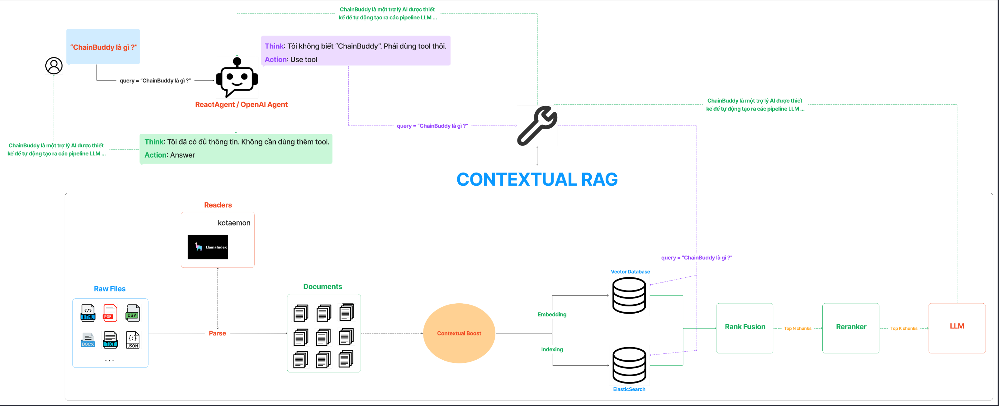

## **Legal advice on road traffic regulations using advanced RAG.**



### **Table of Contents**

1. [**Installation**](#installation)

2. [**Ingest Data**](#ingest-data-examples)

3. [**Continuous Ingestion**](#continuous-ingestion)

4. [**File Readers**](#file-readers)

5. [**Example Usage**](#example-usage)


### **Installation**

To install this application, follow these steps:

**1. Clone the repository:**

```bash
git clone https://github.com/ntdbouque/RAG_Traffic_Law.git
cd RAG_Traffic_Law
```

**2. (Optional) Create and activate a virtual environment:**

-   For Unix/macOS:

```bash
python3 -m venv venv
source venv/bin/activate
```

-   For Windows:

```bash
python -m venv venv
.\venv\Scripts\activate
```

> Note: Please downgrade to `python3.11` if any conflicts occur.

**3. Install the required dependencies:**

```bash
pip install -r requirements.txt
```

**5. Run database:**

```bash
docker compose up -d
```

**6. Config URL for database**: In [config/config.yaml](./config/config.yaml), please modify urls of QdrantVectorDB and ElasticSearch:

```yml
...
CONTEXTUAL_RAG:
    ...
    QDRANT_URL: <fill here>

    ELASTIC_SEARCH_URL: <fill here>
```

**8. Setup API Keys:** Please create `.env` file and provide these API keys:

|         NAME          |                     Where to get ?                      |
| :-------------------: | :-----------------------------------------------------: |
|   `OPENAI_API_KEY`    | [OpenAI Platform](https://platform.openai.com/api-keys) |
| `LLAMA_PARSE_API_KEY` |    [LlamaCloud](https://cloud.llamaindex.ai/api-key)    |
|   `COHERE_API_KEY`    |     [Cohere](https://dashboard.cohere.com/api-keys)     |

https://github.com/user-attachments/assets/b45c9687-278b-4953-9b5b-31fa53db0c8c

---

### **Ingest data (Examples)**

```bash
python source/run/contextual_rag_ingest.py both sample/
```

### **Continuous Ingestion**

-   You can add more file paths or even folder paths:

```bash
python source/run/add_files.py --type both --files a.pdf b.docx
```

---

### **File Readers**


| File extension |        Reader        |
| :------------: | :------------------: |
|     `.pdf`     |     `LlamaParse`     |

-   Example usage of `LlamaParse`:

```python
import os
from pathlib import Path
from dotenv import load_dotenv
from llama_index.readers.llama_parse import LlamaParse

load_dotenv()

loader = LlamaParse(result_type="markdown", api_key=os.getenv("LLAMA_PARSE_API_KEY"))

documents = loader.load_data(Path("sample/2409.13588v1.pdf"))

...
```
### **Example Usage**

-   **1. Contextual RAG**
```python
import os
import sys
from pathlib import Path
sys.path.append(str(Path(__file__).parent.parent.parent))

from icecream import ic

from source.settings import setting as ConfigSetting
from source.rag.retrieval import RetrievalPipeline

RetrievalPipeline = RetrievalPipeline(ConfigSetting)
query = 'Tôi bị tai nạn giao thông, tôi phải làm gì?'
response = RetrievalPipeline.hybrid_rag_search(query)
ic(response)
```
